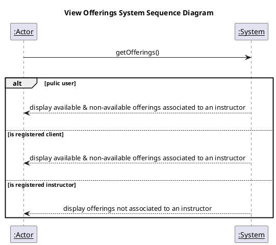
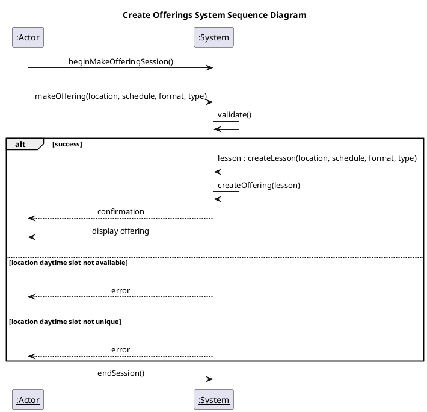
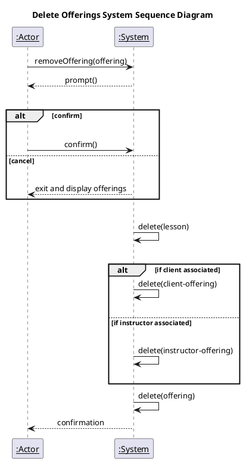
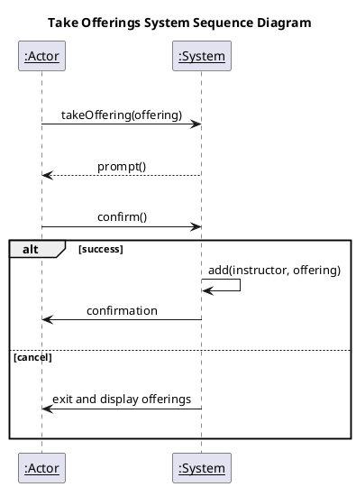

# Offerings System Sequence Diagrams

## Tools

[Plant UML](https://plantuml.com/sequence-diagram)

## View Offering

View Offering plantUml Code

## Create Offering

Create Offering plantUml Code

## Delete Offering

Delete Offering plantUml Code

## Take on Offering

Take Offering plantUml Code

