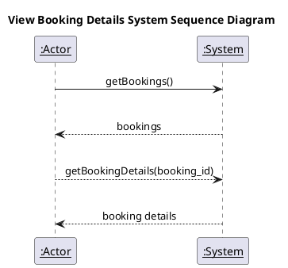
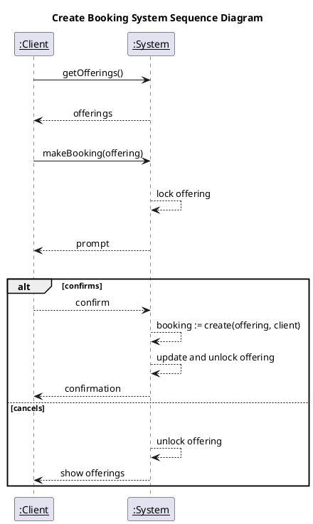
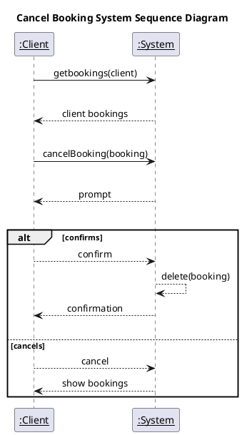

# Bookings System Sequence Diagrams

## Tools

[Plant UML](https://plantuml.com/sequence-diagram)

## View Booking Details

View Booking Details plantUml Code

## Create Booking

Create Booking plantUml Code

## Cancel Booking

Cancel Booking plantUml Code

